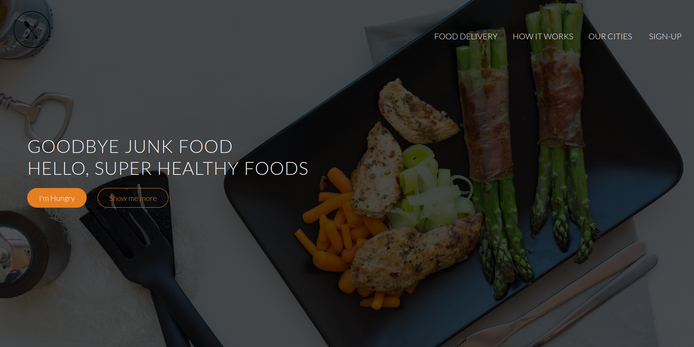

# <a href="https://a07k.github.io/Project-Restaurant/">Omnifood Restaurant</a>

<h2></h2>

<h2>Description</h2>

Omnifood is a premium food delivery service website. It showcases the company's services, how it works, featured cities, customer testimonials, and subscription plans. The site is designed to be responsive and visually appealing, with smooth scrolling and animations.

<h2>Features</h2>

<ul>
  <li>Responsive design</li>
  <li>Interactive navigation</li>
  <li>Animated sections using AOS (Animate On Scroll) library</li>
  <li>Image showcase</li>
  <li>Testimonials</li>
  <li>Pricing plans</li>
  <li>Contact form</li>
  <li>Social media links</li>
</ul>

<h2>Technologies Used</h2>

<ul>
  <li>HTML5</li>
  <li>CSS3</li>
  <li>JavaScript</li>
  <li>jQuery</li>
  <li>Bootstrap 5</li>
  <li>Ionicons</li>
  <li>AOS (Animate On Scroll) library</li>
  <li>Google Fonts (Lato)</li>
</ul>

<h2>Setup and Installation</h2>

<ol>
  <li>Clone the repository:
    <pre><code>git clone https://github.com/your-username/omnifood.git</code></pre>
  </li>
  <li>Navigate to the project directory:
    <pre><code>cd omnifood</code></pre>
  </li>
  <li>Open the index.html file in your web browser to view the website.</li>
</ol>

<h2>Usage</h2>

The website is divided into several sections:

<ul>
  <li>Header with navigation and call-to-action buttons</li>
  <li>Features section highlighting the service benefits</li>
  <li>Meals showcase</li>
  <li>"How it works" section with app download links</li>
  <li>Cities where the service is available</li>
  <li>Customer testimonials</li>
  <li>Sign-up plans</li>
  <li>Contact form</li>
  <li>Footer with additional links and social media</li>
</ul>

Users can navigate through these sections to learn about Omnifood's services and potentially sign up for a plan.

